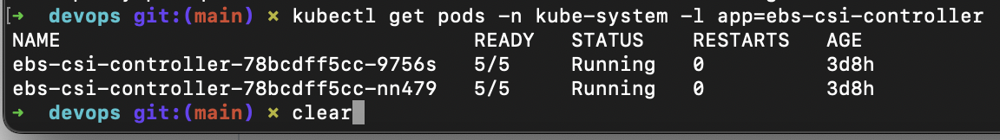
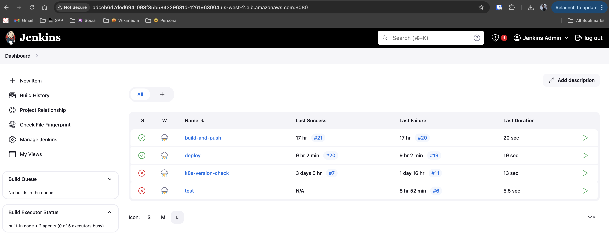
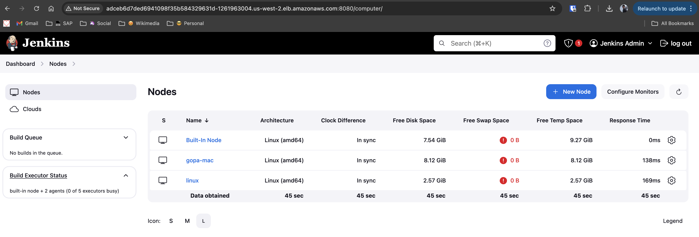

# Set up a CICD server in k8s

Setting up a Continuous Integration/Continuous Deployment (CI/CD) server in Kubernetes using Helm involves deploying a CI/CD tool and related components using Helm charts. Here, we'll demonstrate setting up Jenkins as the CI/CD tool using Helm charts and EBS volumes.

**Step 1: Install Helm**

Make sure you have Helm installed on your local machine. You can find instructions for installing Helm [here](https://helm.sh/docs/intro/install/).


**Step 2: Add the Jenkins Helm repository**

```bash
helm repo add jenkins https://charts.jenkins.io
helm repo update
```

**Step 3: Install Jenkins using Helm**

```bash
helm install jenkins jenkins/jenkins
```

This command installs Jenkins using the Helm chart provided by the stable Helm repository. It deploys Jenkins and its dependencies in your Kubernetes cluster. 

<!-- For instructions on installing Jenkins with Helm, refer to the [Jenkins Helm Install Guide](https://octopus.com/blog/jenkins-helm-install-guide).
 -->

### Step 4: Install the EBS CSI Controller

To manage Amazon EBS volumes in your Kubernetes cluster, you need to install the Amazon EBS CSI driver. Follow these steps:

**Step 1: Apply the EBS CSI Driver Manifest**

```bash
kubectl apply -k github.com/kubernetes-sigs/aws-ebs-csi-driver/deploy/kubernetes/overlays/stable/ecr
```

This command applies the EBS CSI driver manifests from the official repository.

**Step 2: Verify the Installation**

Check that the EBS CSI driver components are running:

```bash
kubectl get pods -n kube-system -l app=ebs-csi-controller
kubectl get pods -n kube-system -l app=ebs-csi-node
```



These commands list the EBS CSI controller and node pods to ensure they are deployed and running correctly.

## Exposing Jenkins Pod

To expose the Jenkins pod using a LoadBalancer, consider the following:

- **Current Approach:** For every service, use a LoadBalancer since native Kubernetes does not support this functionality.
- **Recommended Alternative:** It is recommended to use Ingress for exposing services. Ingress provides a more flexible and reusable way to manage external access to services within a Kubernetes cluster.

### Jenkins

#### Jenkins master 


#### Jenkins nodes 

